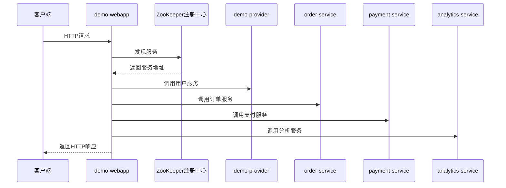

# 微服务接口访问说明文档

## 1. 项目概述

本项目是一个基于Dubbo的微服务架构系统，包含以下核心服务：

- **demo-webapp**: 前端控制器，提供RESTful API接口
- **demo-provider**: 基础服务提供者，实现用户相关功能
- **order-service**: 订单服务，处理订单创建、查询等操作
- **payment-service**: 支付服务，管理支付流程
- **analytics-service**: 数据分析服务，提供数据统计和分析功能

系统使用ZooKeeper作为服务注册中心，使用SkyWalking进行链路追踪和性能监控。

## 2. 服务架构图



## 3. 接口访问信息

### 3.1 基础访问信息

- **Web应用访问地址**: http://localhost:8081
- **SkyWalking监控界面**: http://localhost:8080

### 3.2 服务依赖关系

- **demo-webapp** 依赖其他所有服务
- **order-service** 依赖 **demo-provider**
- **payment-service** 依赖 **order-service**
- **analytics-service** 依赖 **demo-provider**、**order-service** 和 **payment-service**

## 4. 接口详细说明

### 4.1 用户服务接口 (HelloService)

#### 1. 基本问候

- **URL**: GET /hello/{name}
- **参数**: name (路径参数，用户名)
- **返回**: 问候字符串
- **示例**: http://localhost:8081/hello/Alice

#### 2. 获取用户信息

- **URL**: GET /user/{id}
- **参数**: id (路径参数，用户ID)
- **返回**: 用户信息字符串
- **示例**: http://localhost:8081/user/1

#### 3. 获取用户列表

- **URL**: GET /users
- **参数**: 无
- **返回**: 用户列表
- **示例**: http://localhost:8081/users

#### 4. 创建用户

- **URL**: POST /user
- **参数**: JSON请求体 {"name": "用户名", "email": "邮箱地址"}
- **返回**: 创建的用户信息（包含ID）
- **示例请求**:
  ```json
  {
    "name": "Bob",
    "email": "bob@example.com"
  }
  ```

#### 5. 更新用户信息

- **URL**: PUT /user/{id}
- **参数**: id (路径参数，用户ID)，JSON请求体（包含要更新的字段）
- **返回**: 更新结果
- **示例请求**:
  ```json
  {
    "name": "Bob Updated",
    "email": "bob_new@example.com"
  }
  ```

### 4.2 订单服务接口 (OrderService)

#### 1. 创建订单

- **URL**: POST /order
- **参数**: 
  - userId (查询参数，用户ID)
  - items (请求体，商品列表)
- **返回**: 创建的订单信息
- **示例请求**:
  ```json
  [
    {
      "productId": "P001",
      "name": "Demo Product",
      "price": 199.99,
      "quantity": 2
    }
  ]
  ```

#### 2. 获取订单详情

- **URL**: GET /order/{orderId}
- **参数**: orderId (路径参数，订单ID)
- **返回**: 订单详细信息
- **示例**: http://localhost:8081/order/ORDER_123

#### 3. 获取用户订单列表

- **URL**: GET /user/{userId}/orders
- **参数**: userId (路径参数，用户ID)
- **返回**: 用户的所有订单列表
- **示例**: http://localhost:8081/user/1/orders

### 4.3 支付服务接口 (PaymentService)

#### 1. 创建支付

- **URL**: POST /payment
- **参数**: 
  - orderId (查询参数，订单ID)
  - userId (查询参数，用户ID)
  - amount (查询参数，支付金额)
  - paymentMethod (查询参数，支付方式)
- **返回**: 支付信息
- **示例请求**: http://localhost:8081/payment?orderId=ORDER_123&userId=1&amount=399.98&paymentMethod=Credit%20Card

#### 2. 获取支付状态

- **URL**: GET /payment/{paymentId}
- **参数**: paymentId (路径参数，支付ID)
- **返回**: 支付状态信息
- **示例**: http://localhost:8081/payment/PAY_123

### 4.4 数据分析服务接口 (AnalyticsService)

#### 1. 获取用户分析报告

- **URL**: GET /analytics/user/{userId}
- **参数**: userId (路径参数，用户ID)
- **返回**: 用户的分析报告
- **示例**: http://localhost:8081/analytics/user/1

#### 2. 获取系统分析数据

- **URL**: GET /analytics/system
- **参数**: 无
- **返回**: 系统整体分析数据
- **示例**: http://localhost:8081/analytics/system

## 5. 高级功能：复杂调用链路

### 5.1 中等复杂度流程

- **URL**: GET /complex-flow/{name}
- **参数**: name (路径参数，用户名)
- **功能**: 执行包含多个服务调用的复杂流程
- **返回**: 包含多步操作结果的综合响应
- **示例**: http://localhost:8081/complex-flow/Alice

### 5.2 超复杂调用链路

- **URL**: GET /super-complex-flow/{userId}
- **参数**: userId (路径参数，用户ID)
- **功能**: 执行超复杂的调用链路，包括用户创建、订单创建、支付处理、回调处理、数据分析等多个环节
- **返回**: 包含完整流程结果的详细响应
- **示例**: http://localhost:8081/super-complex-flow/user123

## 6. 监控系统使用

### 6.1 SkyWalking界面访问

- **访问地址**: http://localhost:8080
- **登录凭证**: 默认无需登录

### 6.2 监控功能

1. **服务拓扑图**: 查看各服务之间的调用关系
2. **追踪链路**: 查看请求的完整调用链路
3. **服务指标**: 监控服务的响应时间、成功率、请求量等指标
4. **性能分析**: 分析服务性能瓶颈

### 6.3 生成监控数据

要生成监控数据，只需通过上述接口调用服务。例如：

1. 调用复杂流程接口：
   ```bash
   curl http://localhost:8081/super-complex-flow/testuser
   ```

2. 查看SkyWalking UI中的服务拓扑图和追踪数据

## 7. 常见问题排查

### 7.1 服务调用失败

1. 检查服务是否正常运行：
   ```bash
   docker ps | grep -E 'demo|order|payment|analytics|zookeeper'
   ```

2. 查看服务日志：
   ```bash
   docker logs <container_id>
   ```

### 7.2 监控数据不显示

1. 检查SkyWalking OAP和UI是否正常运行
2. 确认服务是否正确配置了SkyWalking Agent
3. 验证服务是否调用了包含`@Trace`注解的方法

## 8. 代码结构

```
/root/4.0/
├── demo-webapp/              # 前端控制器服务
│   └── src/main/java/com/example/demo/controller/
│       └── HelloController.java  # REST接口定义
├── demo-provider/            # 基础服务提供者
│   └── src/main/java/com/example/demo/service/impl/
│       └── HelloServiceImpl.java  # 用户服务实现
├── order-service/            # 订单服务
│   └── src/main/java/com/example/demo/service/impl/
│       └── OrderServiceImpl.java  # 订单服务实现
├── payment-service/          # 支付服务
│   └── src/main/java/com/example/demo/service/impl/
│       └── PaymentServiceImpl.java  # 支付服务实现
├── analytics-service/        # 分析服务
│   └── src/main/java/com/example/demo/service/impl/
│       └── AnalyticsServiceImpl.java  # 分析服务实现
├── demo-api/                 # 基础服务接口定义
├── order-api/                # 订单服务接口定义
├── payment-api/              # 支付服务接口定义
└── skywalking-agent/         # SkyWalking Agent
```

## 9. 示例调用

### 使用curl调用接口示例

1. **创建用户**:
```bash
curl -X POST -H "Content-Type: application/json" -d '{"name":"testuser","email":"test@example.com"}' http://localhost:8081/user
```

2. **创建订单**:
```bash
curl -X POST -H "Content-Type: application/json" --data-binary @- "http://localhost:8081/order?userId=1" << EOF
[
  {
    "productId": "P001",
    "name": "Demo Product",
    "price": 199.99,
    "quantity": 2
  }
]
EOF
```

3. **创建支付**:
```bash
curl -X POST "http://localhost:8081/payment?orderId=ORDER_123&userId=1&amount=399.98&paymentMethod=Credit%20Card"
```

4. **执行复杂流程**:
```bash
curl http://localhost:8081/super-complex-flow/testuser
```

## 7. 实际数据创建示例

以下是实际测试中使用的curl命令，可用于快速创建测试数据：

### 7.1 创建用户

```bash
# 创建用户张三
curl -X POST -H "Content-Type: application/json" -d '{"name":"张三","email":"zhangsan@example.com"}' http://localhost:8081/user

# 创建用户李四
curl -X POST -H "Content-Type: application/json" -d '{"name":"李四","email":"lisi@example.com"}' http://localhost:8081/user
```

### 7.2 创建订单

```bash
# 为张三创建订单（替换为实际用户ID）
curl -X POST -H "Content-Type: application/json" -d '[{"productId":"P001","name":"测试商品","price":99.99,"quantity":2}]' 'http://localhost:8081/order?userId=user_430fe8b8'

# 为李四创建订单（替换为实际用户ID）
curl -X POST -H "Content-Type: application/json" -d '[{"productId":"P002","name":"高级商品","price":199.99,"quantity":1}]' 'http://localhost:8081/order?userId=user_6ea17a8b'
```

### 7.3 创建支付

```bash
# 为张三的订单创建支付宝支付（替换为实际订单ID和用户ID）
curl -X POST 'http://localhost:8081/payment?orderId=ORDER_e7df2c49&userId=user_430fe8b8&amount=199.98&paymentMethod=Alipay'

# 为李四的订单创建信用卡支付（替换为实际订单ID和用户ID）
curl -X POST 'http://localhost:8081/payment?orderId=ORDER_76d805ec&userId=user_6ea17a8b&amount=199.99&paymentMethod=CreditCard'
```

### 7.4 查询数据

```bash
# 查询用户分析报告（替换为实际用户ID）
curl http://localhost:8081/analytics/user/user_430fe8b8

# 查询系统整体分析数据
curl http://localhost:8081/analytics/system
```

> **注意**：执行命令时请替换为实际生成的用户ID和订单ID。